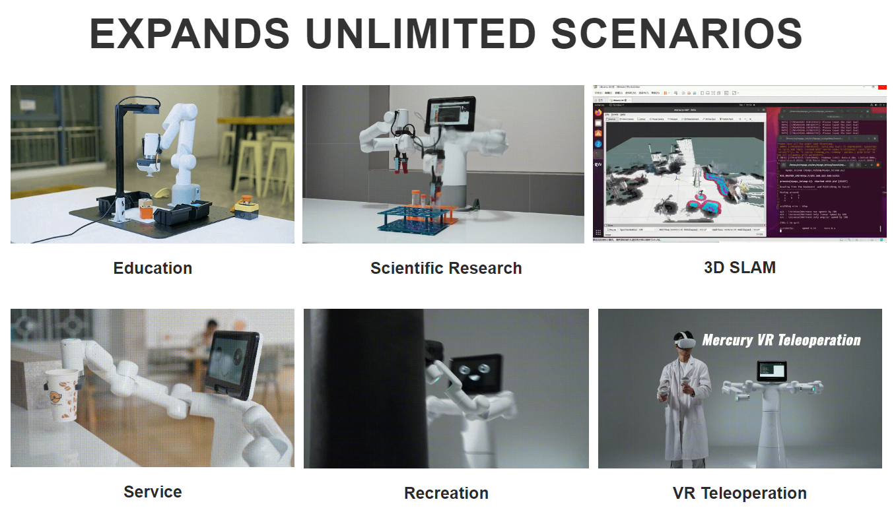

# 1.2 Application scenarios

## 1.2.1 Scientific research scenario

One-stop scientific research on embodied intelligent humanoid robot - Mercury B1.

Thanks to the application of self-developed control algorithms and self-developed modules, X1 can be used for research and applications in multiple directions such as dual-arm collaborative control, dual-arm motion planning, and humanoid embodied intelligence applications. It is the first choice model for humanoid robot application research. .

## 1.2.2 Education scene

Robot education and teaching set, which can be used with 2D or 3D vision modules, can realize image recognition, model training, robot control, motion planning, robot space calibration, vision and robot hand-eye calibration in many disciplines and different fields in humanoid embodied intelligent education. Knowledge learning.

## 1.2.3 Service scenario

The powerful performance and internal performance of the Mercury series, coupled with the elegant appearance design, make the Mercury robot not only used in education and scientific research scenarios, but also in commercial service scenarios. Through different end accessories, it can be matched with various daily furniture and home appliances. The robot can serve actual company displays, business exhibitions, industry exchanges and other application environments, showing the cool applications of robot waiters.

## 1.2.4 Entertainment scene

Paired with a customized end effector to simulate human movement development, the Mercury robot can realize human-like movement applications and carry out creative development of personal applications.

## 1.2.5 VR/Aloha remote operation scene

Paired with VR/Aloha and other equipment to realize remote control robot applications