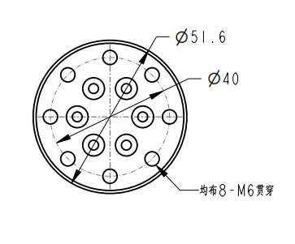

# Structural Dimension Parameters

> This chapter is in millimeters of distance and degrees of angle.

## 1 Product Dimensions & Workspace
  When choosing a robot mounting location, it is important to consider the cylindrical space directly above and below the robot, and avoid moving the tool towards the cylindrical space as much as possible. Because this will cause the joint to rotate too fast when the tool movement is slow, resulting in low robot efficiency and difficult risk assessment.
            
## 2 Base Mounting Dimensions

## 3 Double Arm End Flange Size

 

Figure 2.3.4 End dimensions

---

[← Previous](../2-ProductFeature/2.2-ControlCoreParameter.md)| [Next →](../2-ProductFeature/2.4-ElectricalCharacteristicParameter.md)