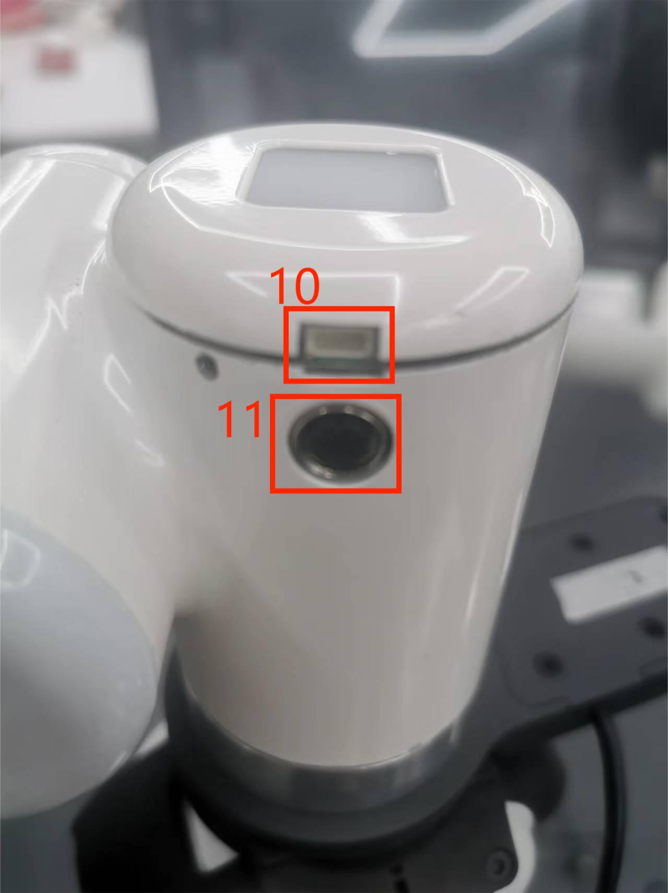
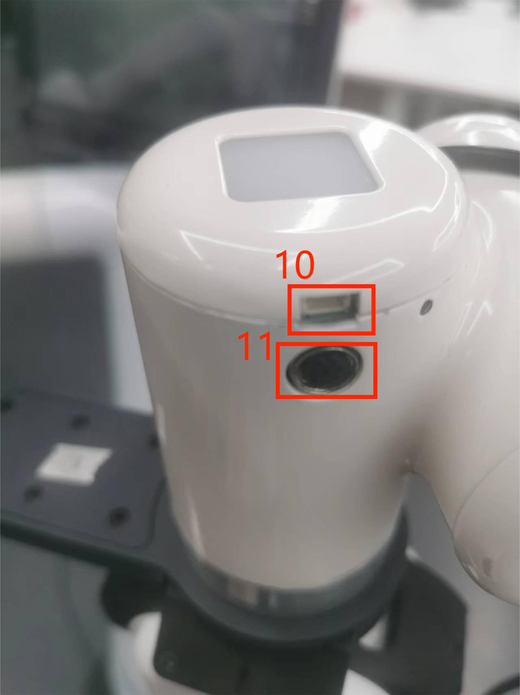

# Electrical Characteristic Parameters

## 1 Overview of the dock interface

Figure 1 Base interface diagram

## 1.1 Dock Interface Description
| Numbered | Interface | Define | Features | Note |
|:----:|:--------------:|:---------:|:-----------------:|:----------------:|
|1  | E-stop interface | STOP      | Emergency stop loop interface |             | 
| 2   | DC/IO interface | 24V       | DC24V             |   DC24V output |
|      |                | OUT1      | Digital output signal 1~6 | The output is only in PNP mode |
|      |                | OUT2      |                   |                  |
|      |                | OUT3      |                   |                  |
|      |                | OUT4      |                   |                  |
|      |                | OUT5      |                   |                  |
|      |                | OUT6      |                   |                  |
|      |                | GND       | GND               |                  |
| 3    | DC/IO interface | GND       | GND               |                  |
|      |                | IN6       | Digital input signal 1~6 | Enter only NPN mode |
|      |                | IN5       |                   |                  |
|      |                | IN4       |                   |                  |
|      |                | IN3       |                   |                  |
|      |                | IN2       |                   |                  |
|      |                | IN1       |                   |                  |
|      |                | 24V       | DC24V             |    DC24V input |
|4  | Ethernet port |    Ethernet | Ethernet communication interface |             | 
| 5 | Power input interface | DC24V input | DC24V input |                  |
| 6  | Switch | Power switch | Control the input power on and off | With light (light on) | 
| 7   |R-USB | Right arm USB | Connect an external camera with USB |                  |
| 8 | L-USB        | Left arm USB | Connect an external camera with USB |  | 
| 9  | USB3.0       | USB3.0*2   | It can be connected to an external device or a USB flash drive                  | 

#### 1 E-stop circuit terminal: connected with the E-stop button box, it can be used to control the emergency stop of the robot
>**Note**: The emergency stop switch must be connected to the robot in use, and ensure that the emergency stop switch circuit is connected.

#### 2 Digital Outputs:
It includes 6 digital output signals that interact with other devices that together form an important part of the automation system.
The output signal is in PNP form, and the following is a schematic diagram of the external wiring:

#### 3 Digital Inputs:
Includes 6 digital input signals, the input signal is in NPN form, the following is a schematic diagram of the external wiring:

#### 4 Network port: A network port is a port used for network data connections. Users can use the Ethernet interface for communication and interaction between the PC and the robot system, as well as Ethernet communication with other devices.

#### 5 Power input interface: This interface is connected to the DC24V power adapter interface
 
#### 6 Power Switch: Control the total power input on and off, when it is off, the controller is also powered off

#### 7 R-USB: 4Pin interface, the right arm camera connects to USB through this interface

#### 8 L-USB: 4Pin port, the left arm camera connects to USB through this port

#### 9 USB3.0 interface: the interface for data connection with serial bus standard 3.0, users can use the USB interface to copy program files, and can also use the USB interface to connect mouse, keyboard and other peripherals
             
## 2 Overview of End Interfaces

Figure 5 End of Left Arm

Figure 6 End of Right Arm

## 2.1 End Interface Description
| Numbered | Interface | Define | Features | Note |
|:------:|:----------------:|:-----------:|:-------------------:|:------------------:|
| 10  |   4pin USB terminal | External interface | Connect the camera |  |
| 11   | M8 Aviation Socket | End Tool IO Interface |  Interact with external devices |                  |

#### 10 USB terminal: used to connect the camera

#### 11 As shown in the diagram is the M8 aero socket I/O diagram, the Mercury X1 robot provides one input and two outputs.

The definition of each tool I/O port is shown in the following table, it should be noted that the tool I/O is PNP type in both input and output, and the wiring method is the same as that of the bottom output interface.

| Numbered | Signal | Explanation | M8 line color |
| :------: | :------: | :-----------------------: | :--------------------------: |
| 1      | GND    | DC24V negative | White |
| 2      | OUT1   | Tool output interface 1 | Brown |
| 3      | OUT2   | Tool output interface 2 | Green |
| 4      | 485A   | Reserved, undeveloped | Yellow |
| 5      | 24V    | DC24V positive | Ash |
| 6      | IN1    | Tool input interface 1 | Powder |
| 7      | IN2    | With input interface 2 | Blue |
| 8      | 485B   | Reserved, undeveloped | Purple |

---

[← Previous](../2-ProductFeature/2.3-MechanicalStructureParameter.md)| [Next →](../2-ProductFeature/2..5-CoordinateSystem.md)