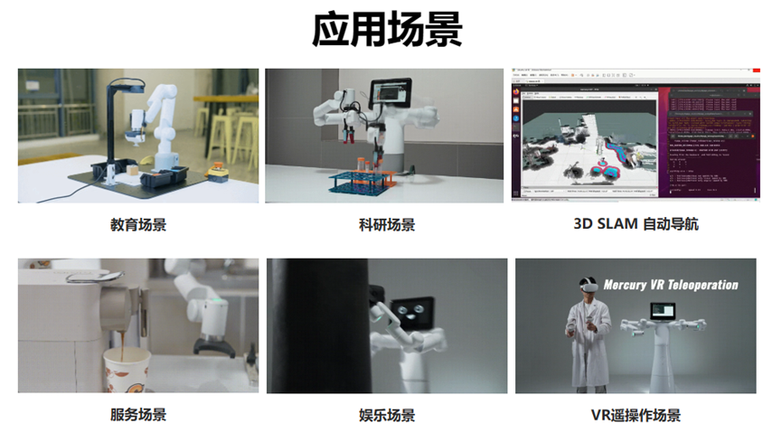

# 1.2 应用场景

## 1.2.1 科研场景

一站式科研具身智能人形机器人 —— 水星Mercury B1。

得益于自研控制算法与自研模组的应用，B1 可用于双臂协同控制、双臂运动规划、人形具身智能应用等多个方向研究与应用，是人形机器人应用研究的首选机型。

## 1.2.2 教育场景

机器人教育教学套装，可搭配2D或3D视觉模组，可以实现人形具身智能教育中图像识别、模型训练、机器人控制、运动规划、机器人空间标定、视觉与机器人手眼标定等多个学科不同领域的知识学习。

## 1.2.3 服务场景

水星Mercury系列的强悍性能及内在表现，搭配优雅的外观设计，使得水星Mercury机器人不仅可以用于教育、科研场景，也可以用于商业服务场景，通过不同的末端配件，搭配各种日常家具家电，机器人可以服务于实际的公司展示、商业展会、行业交流等应用环境，展现机器人服务员的炫酷应用。

## 1.2.4 娱乐场景

搭配自定义的末端执行器，进行模拟人类的动作开发，水星Mercury机器人可以实现类人动作应用，进行个人应用的创意开发。

## 1.2.5 VR/Aloha遥操作场景

搭配VR/Aloha等设备，实现远程操控的机器人应用
